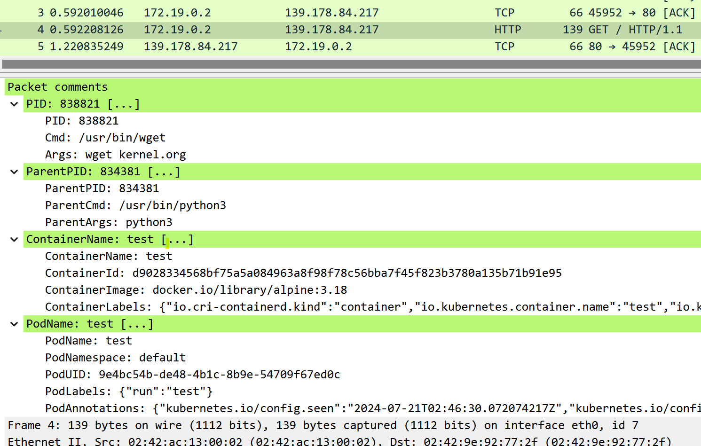

# ptcpdump

ptcpdump is the tcpdump(8) implementation using eBPF, with an extra feature:
it adds process info as packet comments for each Ethernet frame.




## Features

* Aware of the process information associated with the packets.
* Supports using pcap-filter(7) syntax for filtering packets.
* Supports filtering packets by process ID and process name.
* Directly applies filters in the kernel space.
* Supports saving captured packets in the PCAP-NG format for offline analysis with third-party tools such as Wireshark.


## Installation

Please download the latest binary in the [releases](https://github.com/mozillazg/ptcpdump/releases).

### Requirements

Linux kernel version must be larger than 4.18.


## Usage

```
Usage:
  ptcpdump [flags] [expression]

Examples:
  ptcpdump -i any

  ptcpdump -i eth0 --pid 1234 port 80 and host 10.10.1.1

  ptcpdump -i any --pname curl

  ptcpdump -i any -w ptcpdump.pcapng

Expression: see "man 7 pcap-filter"

Flags:
  -Q, --direction string     Choose send/receive direction for which packets should be captured. Possible values are 'in', 'out' and 'inout' (default "inout")
  -f, --follow-forks         Include child processes when filter by process
  -h, --help                 help for ptcpdump
  -i, --interface strings    Interfaces to capture (default [lo])
      --list-interfaces      Print the list of the network interfaces available on the system
      --pid uint             Filter by process ID
      --pname string         Filter by process name
      --print                Print parsed packet output, even if the raw packets are being saved to a file with the -w flag
  -c, --receive-count uint   Exit after receiving count packets
      --version              Print the ptcpdump and libpcap version strings and exit
  -w, --write-file string    Write the raw packets to file rather than parsing and printing them out. e.g. ptcpdump.pcapng
```


### Example output

```
18:05:35.441022 wlp4s0 In IP (tos 0x4, ttl 51, id 0, offset 0, flags [DF], ip_proto TCP (6), length 60)
    185.125.190.29.80 > 192.168.1.50.41966: Flags [S.], cksum 0x68fd, seq 3647722906, ack 1664327469, win 65160, options [mss 1452,sackOK,TS val 1103153989 ecr 3934018003,nop,wscale 7], length 0
    Process (pid 892817, cmd /usr/bin/curl, args curl ubuntu.com)
18:05:35.441298 wlp4s0 Out IP (tos 0x0, ttl 64, id 19415, offset 0, flags [DF], ip_proto TCP (6), length 126)
    192.168.1.50.41966 > 185.125.190.29.80: Flags [P.], cksum 0x39e6, seq 1664327469:1664327543, ack 3647722907, win 502, options [nop,nop,TS val 3934018248 ecr 1103153989], length 74
    Process (pid 892817, cmd /usr/bin/curl, args curl ubuntu.com)
```

